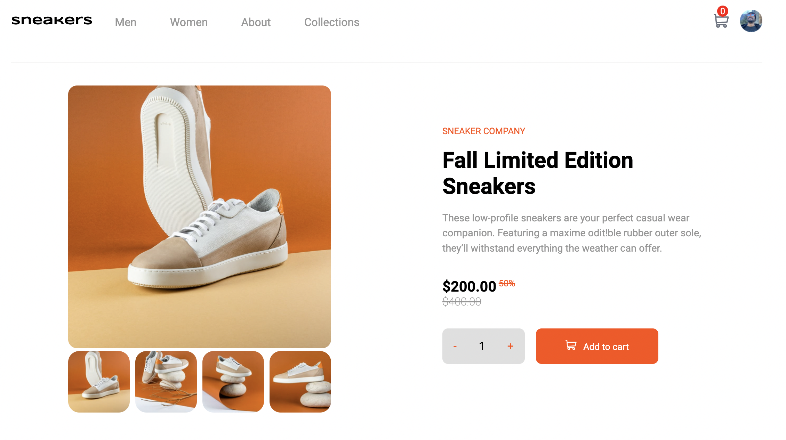
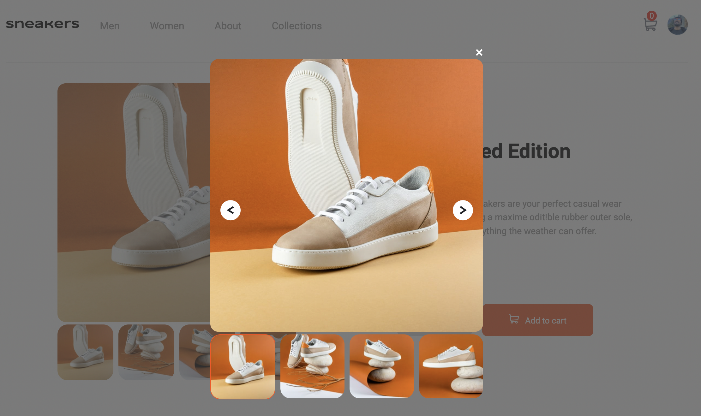
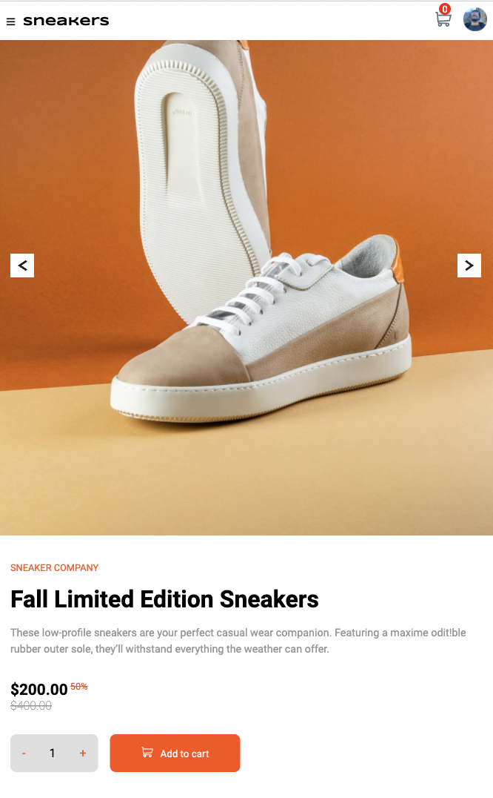

# E-commerce product page solution

## Table of contents

  - [Feature](#feature)
  - [Screenshot](#screenshot)
  - [Built with](#built-with)
  - [Continued development](#continued-development)
  - [Author](#author)

### Feature 

Users should be able to:

- View the optimal layout for the site depending on their device's screen size
- See hover states for all interactive elements on the page
- Open a lightbox gallery by clicking on the large product image
- Switch the large product image by clicking on the small thumbnail images
- Add items to the cart
- View the cart and remove items from it

### Screenshot

### Links

- Solution URL: [Add solution URL here](https://github.com/DanielTeshager/react-ecommerce.git)
- Live Site URL: [Add live site URL here](https://6263ec78662568252dc01f85--rainbow-dodol-791da7.netlify.app/)
### Built with

- Semantic HTML5 markup
- CSS custom properties
- Flexbox
- CSS Grid
- Mobile-first workflow

### Continued development
The Javascript code needs to be refactored to be more modular and reusable.
More features will be added to the site, such as: fetching data from a database, checkout, payment option and more...

## Author

- Twitter - [@danteshager](https://www.twitter.com/danteshager)

